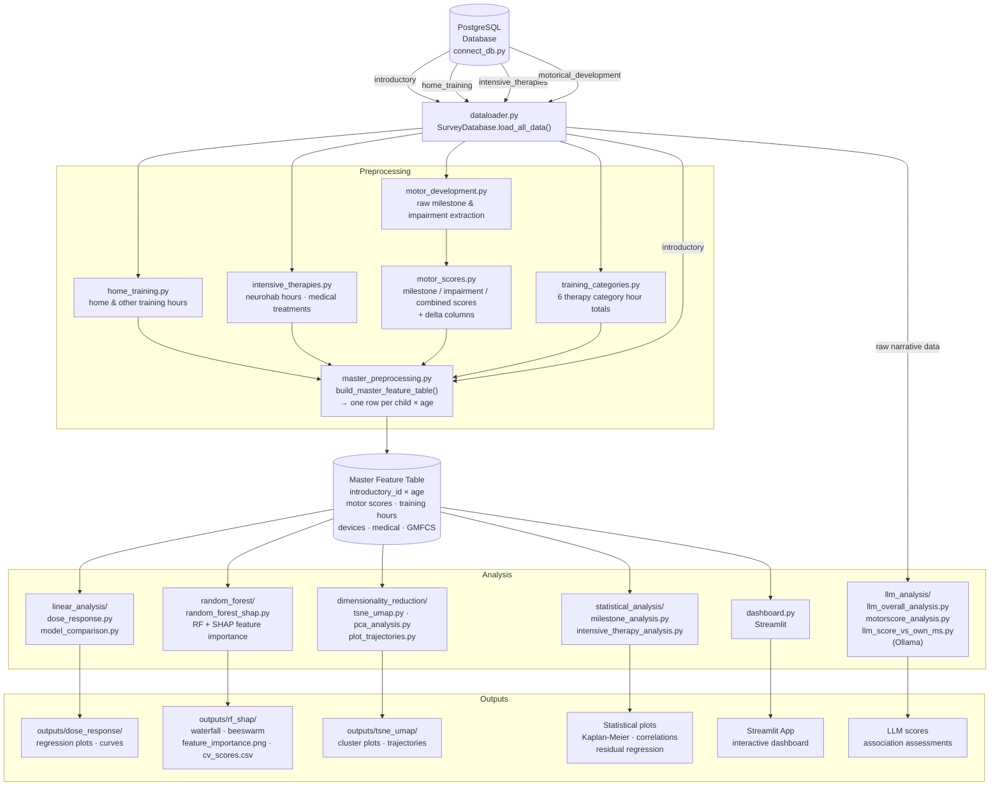

# Data Flow

```mermaid
flowchart TD
    DB[(PostgreSQL\nDatabase\nconnect_db.py)]

    DB -->|introductory| DL
    DB -->|home_training| DL
    DB -->|intensive_therapies| DL
    DB -->|motorical_development| DL

    DL["dataloader.py\nSurveyDatabase.load_all_data()"]

    subgraph prep [" Preprocessing "]
        direction TB
        HT["home_training.py\nhome & other training hours"]
        IT["intensive_therapies.py\nneurohab hours · medical treatments"]
        MD["motor_development.py\nraw milestone & impairment extraction"]
        MS["motor_scores.py\nmilestone / impairment / combined scores\n+ delta columns"]
        TC["training_categories.py\n6 therapy category hour totals"]
        MP["master_preprocessing.py\nbuild_master_feature_table()\n→ one row per child × age"]

        MD --> MS
        HT --> MP
        IT --> MP
        MS --> MP
        TC --> MP
    end

    DL --> HT
    DL --> IT
    DL --> MD
    DL --> TC
    DL -->|introductory| MP

    MP --> MFT[("Master Feature Table\nintroductory_id × age\nmotor scores · training hours\ndevices · medical · GMFCS")]

    subgraph analysis [" Analysis "]
        direction TB
        LIN["linear_analysis/\ndose_response.py\nmodel_comparison.py"]
        RF["random_forest/\nrandom_forest_shap.py\nRF + SHAP feature importance"]
        DIM["dimensionality_reduction/\ntsne_umap.py · pca_analysis.py\nplot_trajectories.py"]
        LLM["llm_analysis/\nllm_overall_analysis.py\nmotorscore_analysis.py\nllm_score_vs_own_ms.py\n(Ollama)"]
        STAT["statistical_analysis/\nmilestone_analysis.py\nintensive_therapy_analysis.py"]
        DASH["dashboard.py\nStreamlit"]
    end

    MFT --> LIN
    MFT --> RF
    MFT --> DIM
    MFT --> STAT
    MFT --> DASH
    DL -->|raw narrative data| LLM

    subgraph out [" Outputs "]
        direction TB
        O1["outputs/dose_response/\nregression plots · curves"]
        O2["outputs/rf_shap/\nwaterfall · beeswarm\nfeature_importance.png · cv_scores.csv"]
        O3["outputs/tsne_umap/\ncluster plots · trajectories"]
        O4["LLM scores\nassociation assessments"]
        O5["Statistical plots\nKaplan-Meier · correlations\nresidual regression"]
        O6["Streamlit App\ninteractive dashboard"]
    end

    LIN --> O1
    RF  --> O2
    DIM --> O3
    LLM --> O4
    STAT --> O5
    DASH --> O6
```
